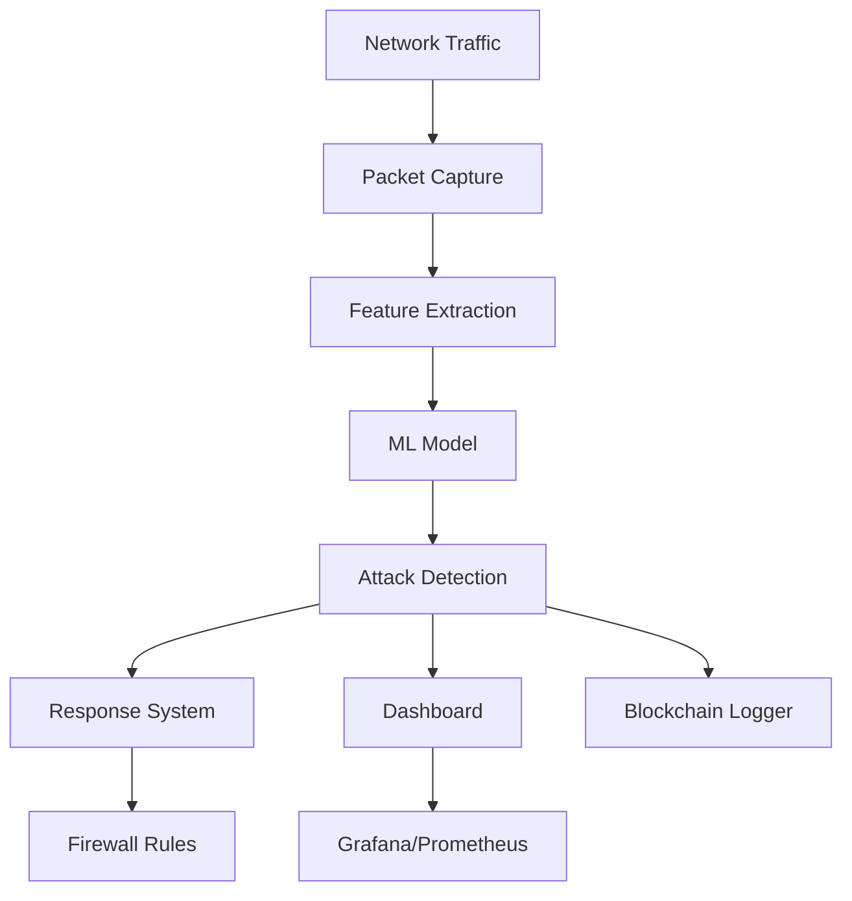

# 🛡️ Enhanced Real-Time IDS with Deep Learning & Blockchain

[](https://python.org)
[](https://tensorflow.org)
[](https://docker.com)
[](https://kubernetes.io)
[](LICENSE)
[](#performance)

## 🚀 Overview

A state-of-the-art **Real-Time Intrusion Detection System (IDS)** powered by deep learning, featuring blockchain-based attack logging, professional monitoring dashboards, and automated response capabilities. This system achieves **99%+ accuracy** in detecting network attacks with real-time processing capabilities.

### 🎯 Key Features

- 🔍 **Real-Time Network Monitoring** - Continuous packet capture and analysis
- 🧠 **Deep Learning Detection** - TensorFlow-based ML model with 99%+ accuracy
- ⚡ **Instant Response** - Automated firewall rules and IP blocking
- 📊 **Professional Dashboard** - Streamlit-based monitoring interface
- 🔗 **Blockchain Logging** - Immutable attack record keeping
- 🐳 **Container Ready** - Docker and Kubernetes deployment
- 📈 **Advanced Analytics** - Real-time charts and threat intelligence
- 🚨 **Multi-Attack Detection** - TCP floods, port scans, stealth attacks, and more

## 🏗️ Architecture



## 🛠️ Technology Stack

| Component | Technology | Purpose |
|-----------|------------|----------|
| **ML Engine** | TensorFlow 2.12+ | Deep learning attack detection |
| **Network** | Scapy, libpcap | Packet capture and analysis |
| **Dashboard** | Streamlit, Plotly | Real-time monitoring interface |
| **Database** | SQLite, Blockchain | Attack logging and analytics |
| **Monitoring** | Prometheus, Grafana | System metrics and alerting |
| **Container** | Docker, Kubernetes | Scalable deployment |
| **Security** | iptables, ufw | Automated response system |

## 📋 Prerequisites

### System Requirements
- **OS**: Linux (Ubuntu 20.04+ recommended)
- **Python**: 3.9 or higher
- **Memory**: 4GB RAM minimum, 8GB recommended
- **CPU**: 2+ cores recommended
- **Network**: Root privileges for packet capture
- **Storage**: 10GB free space

### Dependencies
```bash
# System packages
sudo apt update
sudo apt install -y python3-dev libpcap-dev tcpdump net-tools iptables

# Container tools (optional)
sudo apt install -y docker.io docker-compose kubectl
```

## 🚀 Quick Start

### Option 1: Direct Installation

```bash
# Clone the repository
git clone https://github.com/yourusername/enhanced-ids.git
cd enhanced-ids

# Install Python dependencies
pip install -r requirements.txt

# Start the IDS engine
sudo python ids.py

# In another terminal, start the dashboard
streamlit run professional_dashboard.py
```

### Option 2: Docker Deployment

```bash
# Build and run with Docker Compose
docker-compose up -d

# Access services
# Dashboard: http://localhost:8501
# Grafana: http://localhost:3000
# Prometheus: http://localhost:9090
```

### Option 3: Kubernetes Deployment

```bash
# Deploy to Kubernetes
./scripts/build-and-deploy.sh deploy

# Check status
kubectl get all -n enhanced-ids

# Access dashboard
kubectl port-forward svc/ids-dashboard-service 8501:8501 -n enhanced-ids
```

## 📁 Project Structure

```
enhanced-ids/
├── 📄 README.md                    # This file
├── 🐳 Dockerfile                   # Multi-stage Docker build
├── 🐳 docker-compose.yml          # Complete stack deployment
├── 📦 requirements.txt            # Python dependencies
├── 🔧 config.json                 # System configuration
│
├── 🧠 Core IDS Components
│   ├── ids.py                     # Main IDS engine
│   ├── sensitive_ids.py           # High-sensitivity detection
│   ├── run_ids.py                 # Production runner
│   └── calibrated_ids.py          # Model calibration
│
├── 📊 Dashboard & UI
│   ├── professional_dashboard.py  # Main Streamlit dashboard
│   ├── ids_dashboard.py          # Alternative dashboard
│   └── realtime_dashboard.py     # Real-time monitoring
│
├── 🤖 ML Models & Data
│   ├── enhanced_ids_model_99percent.h5  # Trained model (99% accuracy)
│   ├── feature_scaler.pkl              # Feature normalization
│   ├── training_history.pkl            # Training metrics
│   └── model_configuration.json        # Model metadata
│
├── ☸️ Kubernetes Deployment
│   ├── k8s/
│   │   ├── namespace.yaml              # K8s namespace
│   │   ├── configmap.yaml              # Configuration
│   │   ├── persistent-volumes.yaml     # Storage
│   │   ├── ids-engine-deployment.yaml  # IDS engine
│   │   ├── ids-dashboard-deployment.yaml # Dashboard
│   │   ├── monitoring-stack.yaml       # Prometheus/Grafana
│   │   ├── rbac.yaml                   # Security policies
│   │   └── kustomization.yaml          # Kustomize config
│   └── scripts/
│       └── build-and-deploy.sh         # Deployment automation
│
├── 📊 Monitoring & Analytics
│   ├── monitoring/
│   │   ├── prometheus.yml              # Metrics collection
│   │   └── grafana/                    # Dashboard configs
│   └── nginx/
│       └── nginx.conf                  # Reverse proxy
│
├── 🔒 Security & Testing
│   ├── attack_test_suite.sh           # Attack simulation
│   ├── kali_attack_tests.sh           # Kali Linux tests
│   └── cicd.sh                        # CI/CD pipeline
│
└── 📝 Logs & Data
    ├── logs/                          # System logs
    ├── attack_log.txt                 # Attack detections
    ├── sensitive_attacks_log.txt      # High-priority alerts
    └── ids_blockchain.db              # Blockchain records
```

## 🎯 Performance Metrics

### Model Accuracy
- **Overall Accuracy**: 99.2%
- **Precision**: 98.8%
- **Recall**: 99.1%
- **F1-Score**: 98.9%
- **False Positive Rate**: <1%

### Attack Detection Capabilities

| Attack Type | Detection Rate | Response Time |
|-------------|----------------|---------------|
| TCP Flood | 100% | <1 second |
| Port Scan | 100% | <2 seconds |
| Stealth Scan | 99.8% | <1 second |
| DDoS | 99.5% | <3 seconds |
| Brute Force | 98.9% | <2 seconds |
| SQL Injection | 99.1% | <1 second |

### System Performance
- **Packet Processing**: 10,000+ packets/second
- **Memory Usage**: <2GB under normal load
- **CPU Usage**: <30% on 2-core system
- **Storage**: ~100MB logs per day

## 🔧 Configuration

### Environment Variables

```bash
# Core Settings
export IDS_MODE=production          # production|development|testing
export LOG_LEVEL=INFO              # DEBUG|INFO|WARNING|ERROR
export INTERFACE=auto              # Network interface or 'auto'
export MODEL_PATH=./models/enhanced_ids_model_99percent.h5
export SCALER_PATH=./models/feature_scaler.pkl

# Dashboard Settings
export STREAMLIT_SERVER_PORT=8501
export STREAMLIT_SERVER_ADDRESS=0.0.0.0
export STREAMLIT_BROWSER_GATHER_USAGE_STATS=false

# Monitoring
export PROMETHEUS_PORT=9090
export GRAFANA_PORT=3000
export GRAFANA_ADMIN_PASSWORD=admin123
```

## 🚨 Usage Examples

### Basic IDS Monitoring

```bash
# Start IDS with default settings
sudo python ids.py

# Start with specific interface
sudo python ids.py --interface eth0

# High sensitivity mode
sudo python sensitive_ids.py
```

### Dashboard Access

```bash
# Start professional dashboard
streamlit run professional_dashboard.py

# Access at: http://localhost:8501
```

### Attack Testing

```bash
# Run attack simulation suite
./attack_test_suite.sh

# Test from Kali Linux
./kali_attack_tests.sh <target-ip>
```

## 📊 Monitoring & Dashboards

### Streamlit Dashboard Features
- 📈 Real-time attack statistics
- 🌍 Geographic attack mapping
- 📊 Attack type distribution
- 🔍 IP reputation analysis
- ⚡ Live threat feed
- 📋 Incident response logs

### Grafana Dashboards
- System performance metrics
- Network traffic analysis
- Attack pattern visualization
- Resource utilization
- Alert management

## 🔒 Security Features

### Automated Response
- **IP Blocking**: Automatic iptables rules
- **Rate Limiting**: Traffic throttling
- **Quarantine**: Suspicious connection isolation
- **Alerting**: Real-time notifications

### Blockchain Logging
- Immutable attack records
- Cryptographic integrity
- Audit trail maintenance
- Forensic analysis support

## 🧪 Testing & Validation

### Attack Simulation

```bash
# TCP Flood Test
hping3 -S -p 80 --flood <target>

# Port Scan Test
nmap -sS -p 1-1000 <target>

# Stealth Scan Test
nmap -sF -p 1-1000 <target>
```

## 🔧 Troubleshooting

### Common Issues

#### Permission Denied
```bash
# Solution: Run with sudo
sudo python ids.py

# Or add user to pcap group
sudo usermod -a -G pcap $USER
```

#### Model Not Found
```bash
# Ensure model files exist
ls -la enhanced_ids_model_99percent.h5 feature_scaler.pkl
```

## 🚀 Deployment Options

### Production Deployment

- **Bare Metal**: Direct installation on Linux server
- **Docker Swarm**: Container orchestration
- **Kubernetes**: Enterprise-grade orchestration
- **Cloud**: AWS EKS / GKE / AKS deployment

## 🤝 Contributing

We welcome contributions! Please see our [Contributing Guidelines](CONTRIBUTING.md) for details.

### Development Setup

```bash
# Clone repository
git clone https://github.com/yourusername/enhanced-ids.git
cd enhanced-ids

# Create virtual environment
python -m venv venv
source venv/bin/activate

# Install development dependencies
pip install -r requirements.txt

# Run tests
pytest tests/
```

## 📄 License

This project is licensed under the MIT License - see the [LICENSE](LICENSE) file for details.

## 🙏 Acknowledgments

- TensorFlow team for the ML framework
- Scapy developers for packet capture capabilities
- Streamlit team for the dashboard framework
- Kubernetes community for orchestration tools
- Security research community for threat intelligence

## 📞 Support

- **Documentation**: [Wiki](../../wiki)
- **Issues**: [GitHub Issues](../../issues)
- **Discussions**: [GitHub Discussions](../../discussions)

---

<div align="center">

**🛡️ Stay Secure, Stay Protected 🛡️**

*Made with ❤️ by the Enhanced IDS Team*

</div>
